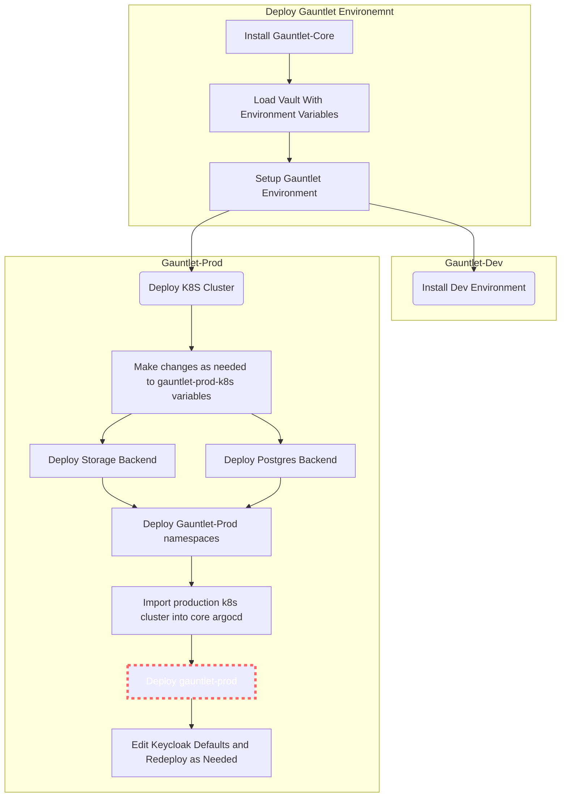

# gauntlet-prod-argo



## Getting started

**IMPORTANT**: Gauntlet-Core must be deployed first, Gauntlet-Prod deployment relies on ArgoCD and Vault to deploy manifests.

To Install: 
```bash
# Git-clone this repository and navigate to the folder
# Authenticate to the production kuster with kubectl
kubectl apply -f root-app.yaml
```

`root-app.yaml` is an argo app-of-apps that manages several sub-app-of-apps to deploy the core components of gauntlet.

`apps/crucible-generator.yaml` : Deploys crucible apps to the crucible namespace. App definitons are sourced from `apps/crucible` 

    Deployed apps:
    + alloy
    + blueprint
    + caster
    + cite
    + gallery
    + landing
    + player
    + steamfitter

`apps/bitnami-generator.yaml` : Deploys Bitnami oci charts to the crucible namespace. App definitons are sourced from `apps/crucible-external-bitnami` 

    Deployed apps:
    + Keycloak

`apps/crucible-external-generator`: Deploys traditional helm charts to crucible namespace. App definitions are sourced from `apps/crucible-external`

    Deployed apps:
    + Stackstorm

`apps/crucible-monitoring-generator`: Deploys The monitoring stack to the monitoring namespace. App definitions are sourced from `apps/monitoring`

    Deployed apps:
    + kube-prometheus-stack

`apps/crucible-project` and `apps/monitoring-project` limit the destinations apps can be deployed to when deployed through argo. This serves as an extra layer of RBAC in case of malicious actors.


