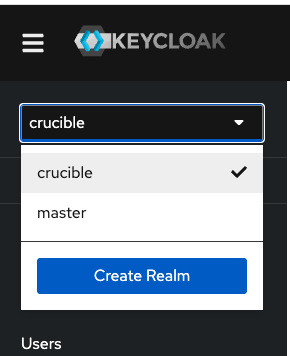
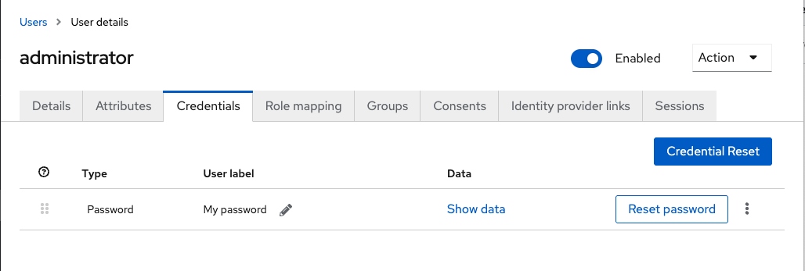
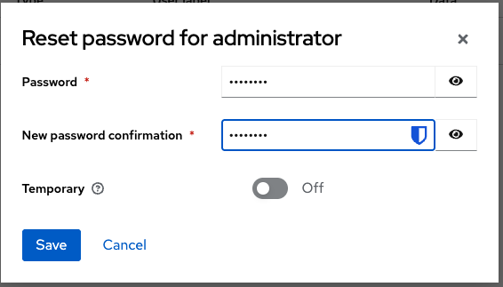

## Change Keycloak password
1. open keycloak admin url for the `master` realm [https://onprem.phl-imcite.net/keycloak/admin](https://onprem.phl-imcite.net/keycloak/admin)

```
username: admin
password: crucible
```
in the upper left corner select the dropdown that says "master" this is the realm selector. Change the realm to "crucible"



select "Users" from the menu on the left.
click the "administrator" user
select the credential tab
click the "Reset Password" button and a dialog will pop up



Enter "crucible" for the new password. or Whatever password you would like.
Make sure to set "Temporary" to off otherwise you'll need to reset your password on first login
click "Save" and confirm the password reset, a message should popup in the upper right hand corner stating the user was saved successfully



The password is now reset.